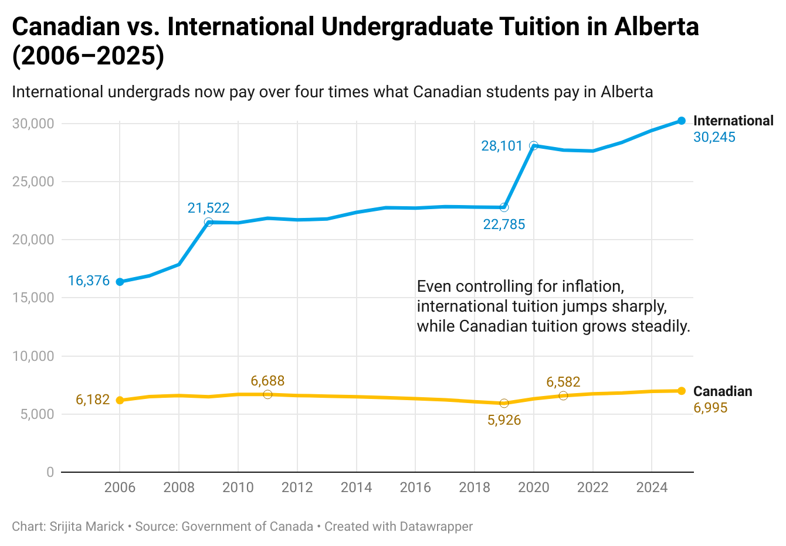
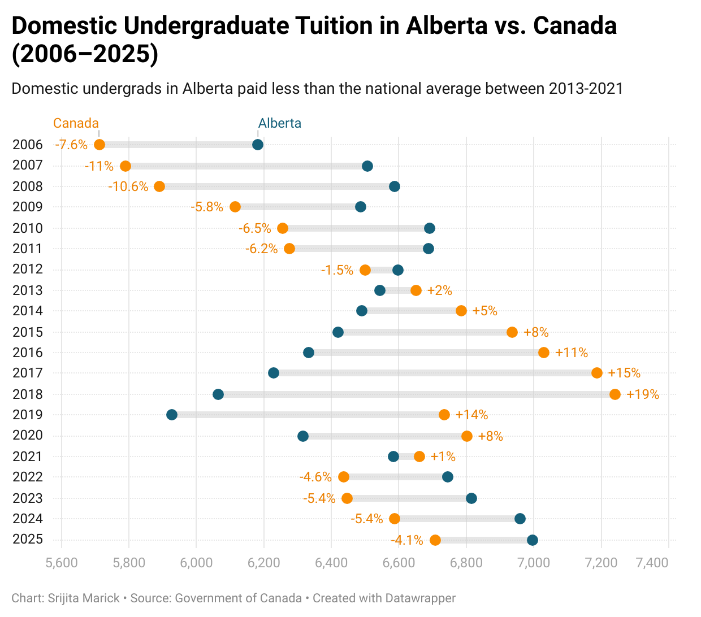
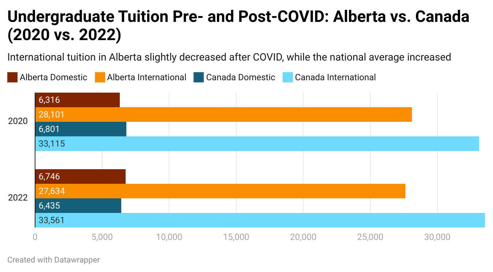
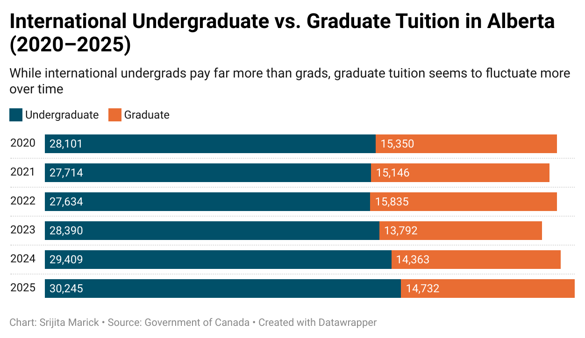
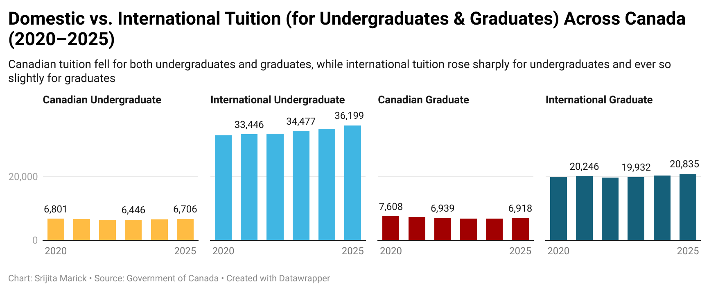

# Data Theme: Higher Education 

## About
The data set for this directory of class comes from the government of Canada and provides time series data for tuition 
for Canadian and International students for Canada overall and Alberta. The value is given in constant dollars, this 
means that the value is controlled for inflation. 

## Visualizations

### Visualization 1  

### Visualization 2 

### Visualization 3

### Visualization 4 

### Visualization 5 
