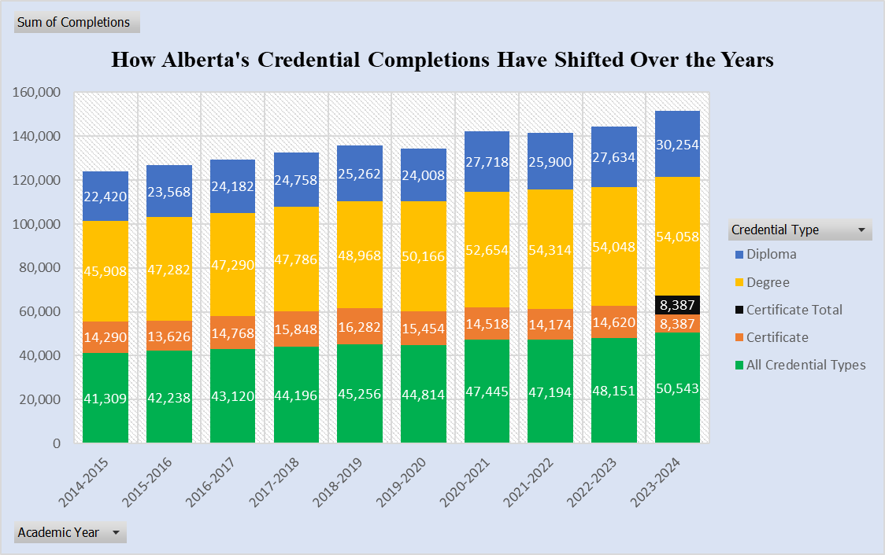
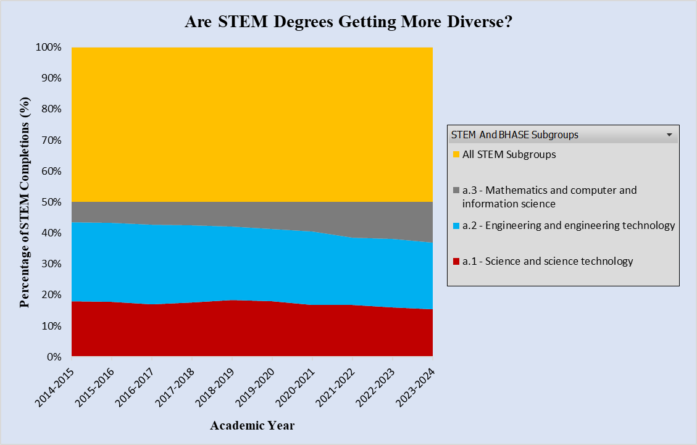
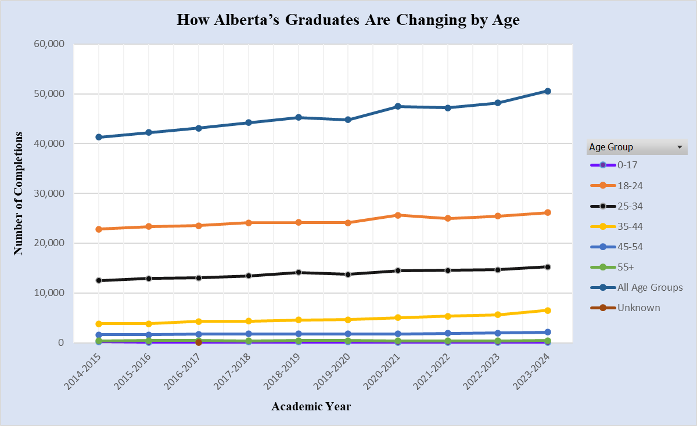
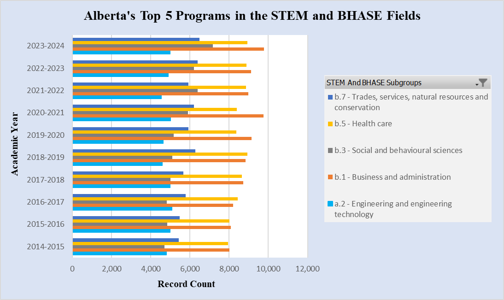

# Data Theme: Higher Education

## About
The data set for this directory comes from the 
[Alberta Government](https://open.alberta.ca/opendata/system-wide-program-completions-within-the-alberta-post-secondary-education-system) 
and focuses on system wide completions of different credentials. 

On their website the Alberta Government describes the data set as follows:

*"This statistic describes the record count of completions by each institution and academic year within Alberta's 
publicly-funded post-secondary education system. Completions represent the status of the learner, at the program level, 
at the end of a given session. The data tables presented are related to program completions in approved credential 
programs at publicly-funded post-secondary institutions within Alberta. Separate data files exist focusing on the 
system level, or for subsets that focus on either international or self-identified Indigenous learners."*

## Visualizations  

### Visualization 1  

### Visualization 2 

### Visualization 3

### Visualization 4 

### Visualization 5 
