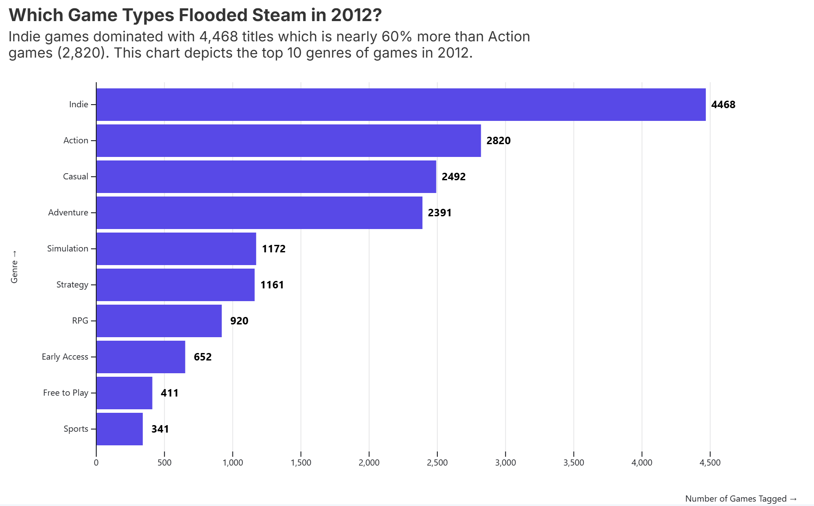
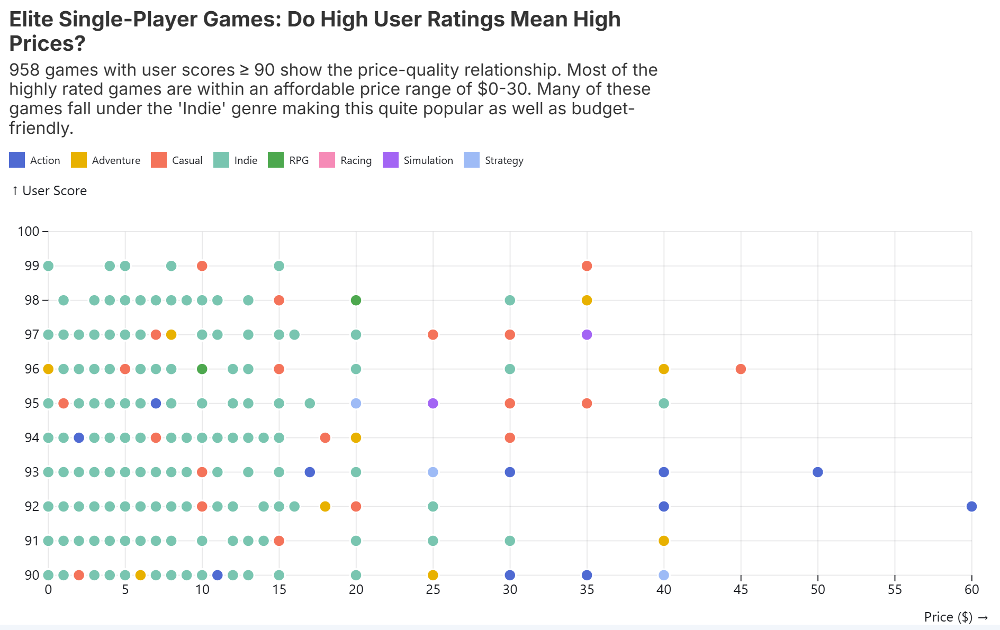
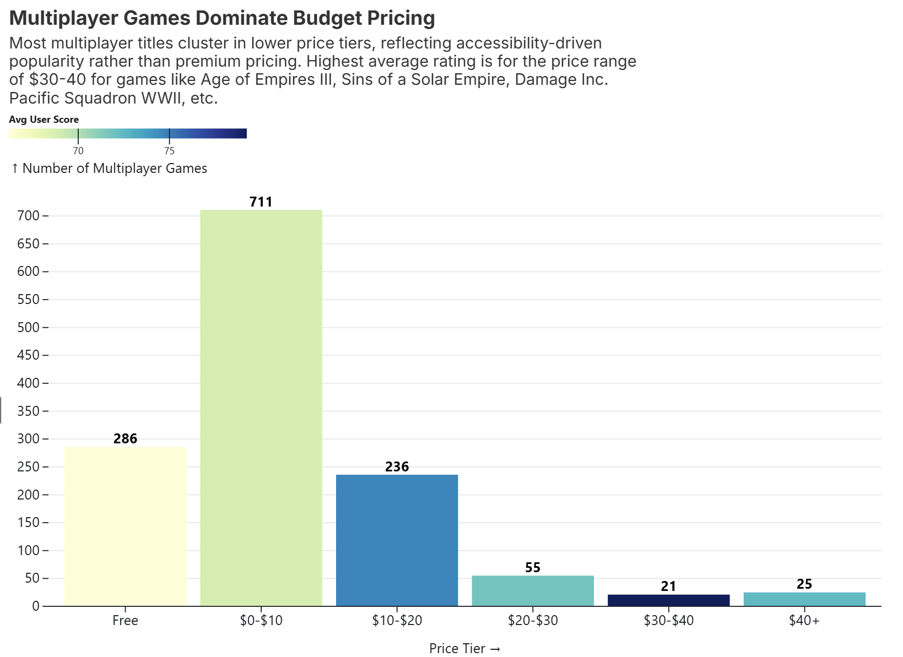
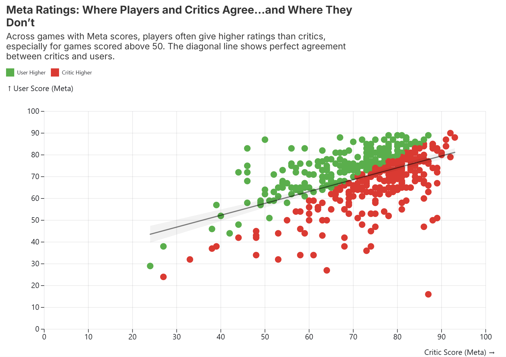
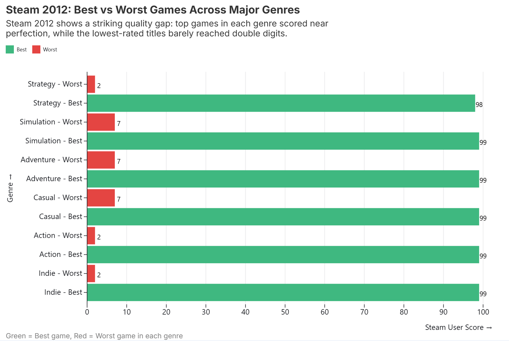

# Data Theme: Entertainment Old and New

## Data Background

### Topic
Games published on Steam, an online game distribution platform.

## About
### Data set attribution
The data set for this directory is from a [github repository](https://github.com/leinstay/steamdb) by 
[leinstay](https://github.com/leinstay).

### What it covers
All games published to Steam

### Time range
Its time range includes from 1998 to 2020 but we will only be looking at 2012.

### Data coverage
For scale, it has been filtered to only a single year and only included attributes of the game's publication, genre, and ratings.

### Other Context
Apart from the direct data from Steam, the data set also included information from "meta_" and "igdb_" on these Steam 
games. These are from [Metacritic](https://www.metacritic.com/game/) and [IGDB](https://www.igdb.com/) respectively, 
media review sites that provide their own scores for games and allows users to submit scores for games. Please note, 
score in this context is not a high score in a game but a rating score of how good a person thinks the game is.

## Visualizations  

### Visualization 1  

### Visualization 2 

### Visualization 3

### Visualization 4 

### Visualization 5 
