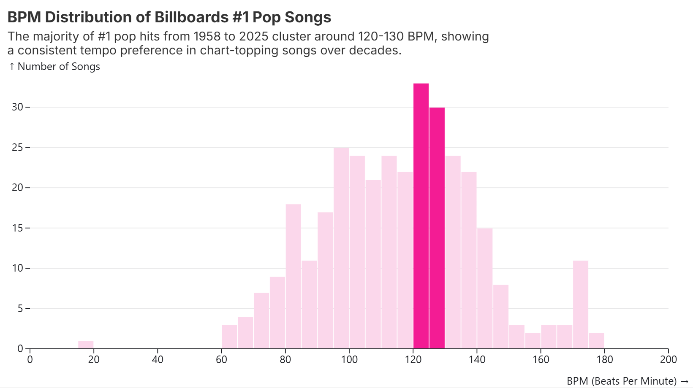
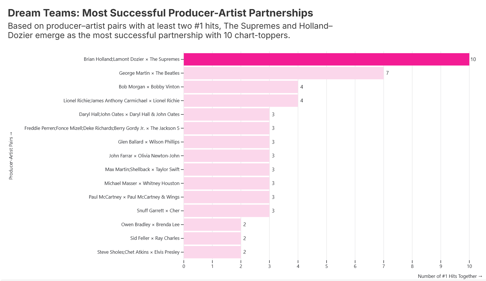
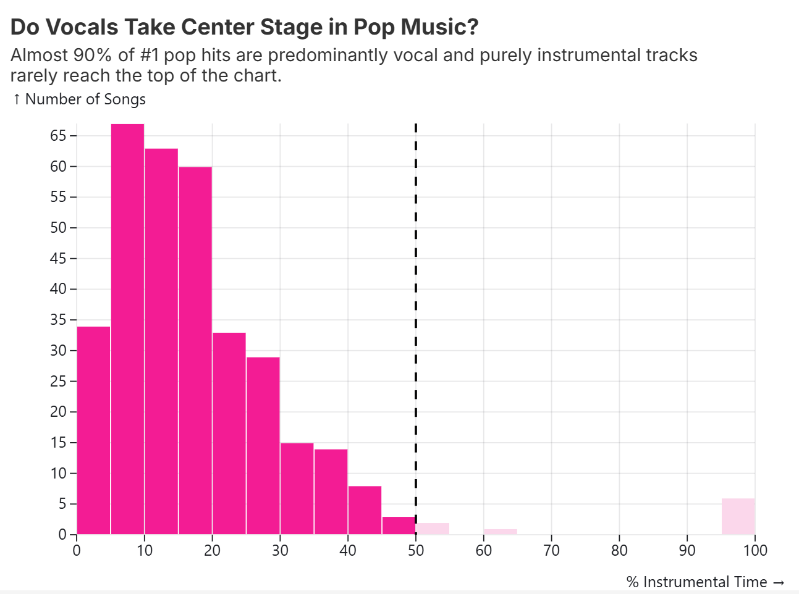
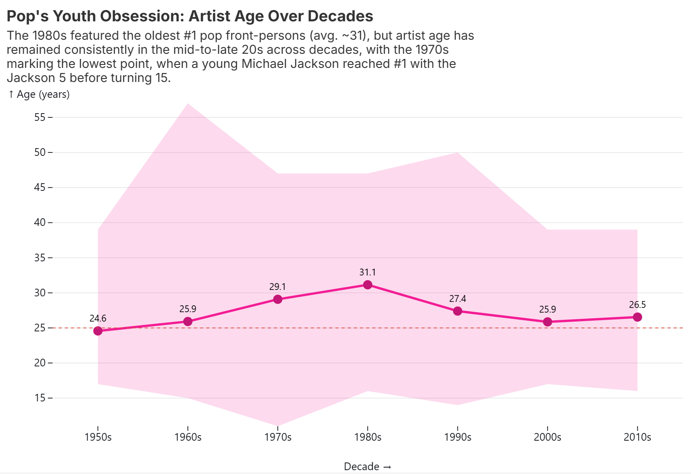
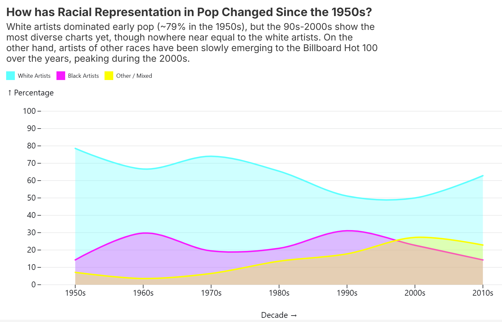

# Data Theme: Entertainment Old and New

## Data Topic and Background

### Topic
Billboard top 100 songs.

## About
### Data set attribution
[The data set for this directory](https://docs.google.com/spreadsheets/d/1j1AUgtMnjpFTz54UdXgCKZ1i4bNxFjf01ImJ-BqBEt0/edit?gid=1974823090#gid=1974823090) 
is compiled by [Chris Dalla Riva](https://https//www.chrisdallariva.com/band). 
We came across this data set on the site [Data is Plural](https://www.data-is-plural.com/). 

### How it was collected
This data was compiled for the writing of a book by Chris Dalla Riva

### What it covers and time range
Every song to ever top the Billboard Hot 100 between August 4, 1958 and January 11, 2025

### Data coverage
As we are at the end of the course, we will give you the full data set. Because the lecture theme for the week is multi-dimensional vis we encourage you to use different encodings and filters to work with the data to try and show many dimensions. This is a wide and short data set. Part of your task this week is to decide what dimensions to use and how to show them. 

### Other Context
You are advised to read the 
[data dictionary](https://https//docs.google.com/spreadsheets/d/1j1AUgtMnjpFTz54UdXgCKZ1i4bNxFjf01ImJ-BqBEt0/edit?gid=82262432#gid=82262432) 
in the linked data set to understand and work with the different attributes. 

## Visualizations  

### Visualization 1  

### Visualization 2 

### Visualization 3

### Visualization 4 

### Visualization 5 
