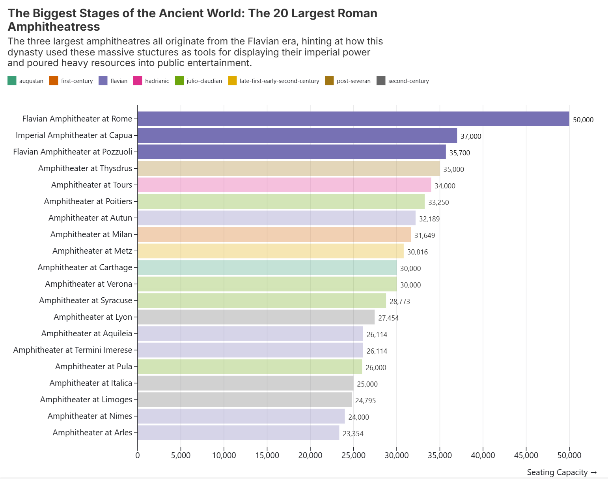
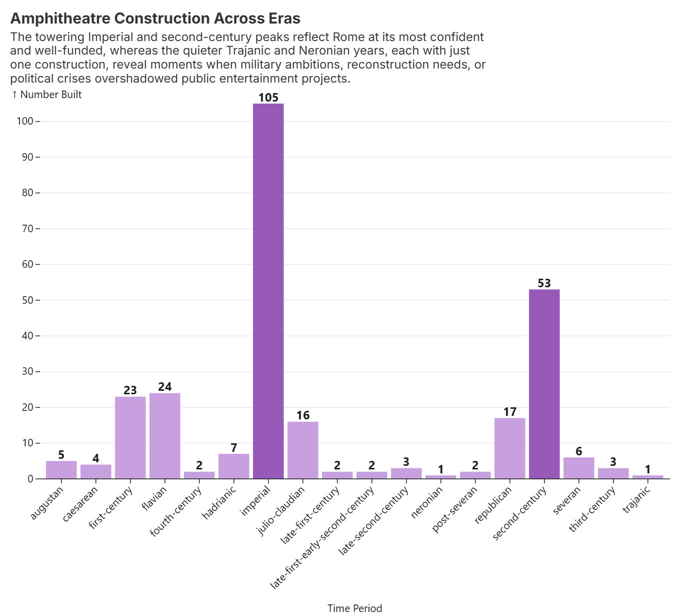
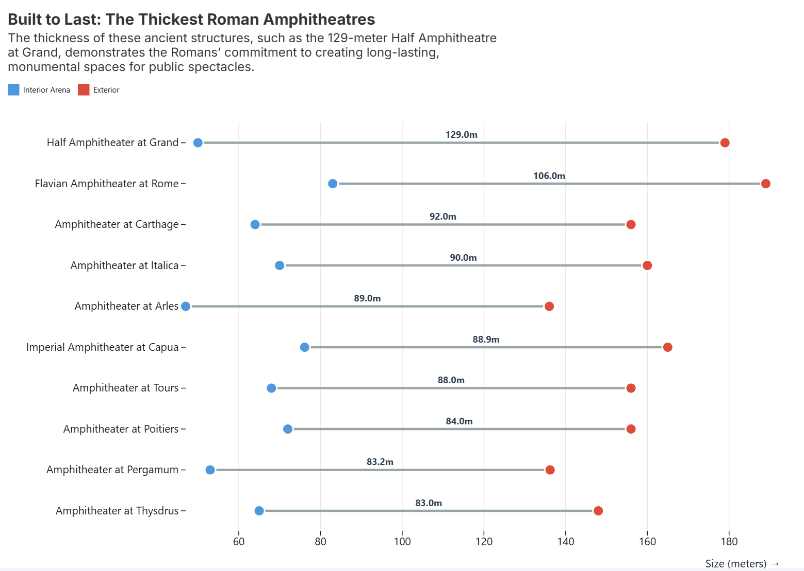
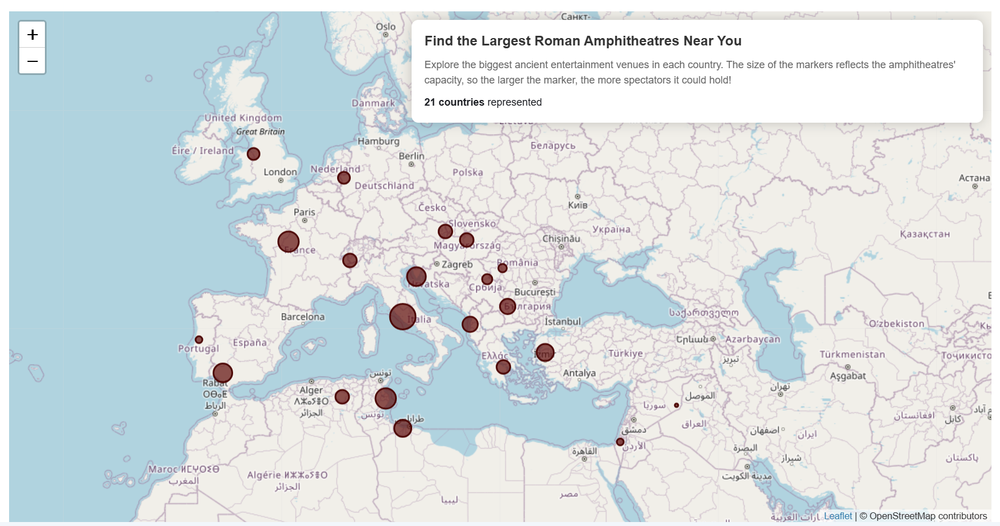
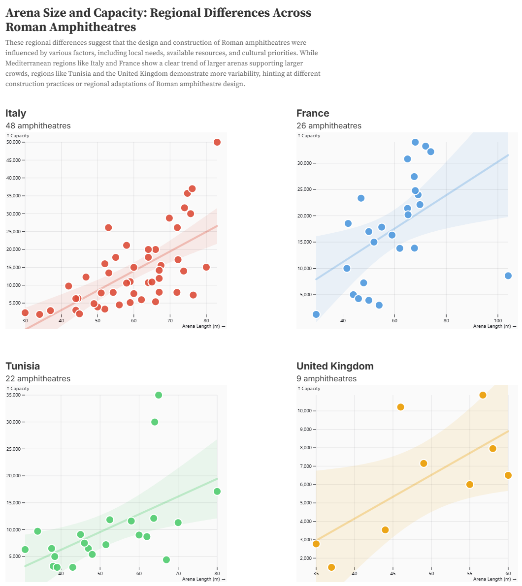

# Data Theme: Entertainment Old and New

## Data Topic and Background

### Topic
Very old sites of entertainment [Roman Amphitheatres](https://github.com/roman-amphitheaters/roman-amphitheaters)

## About
### Data set attribution
The data set for this directory is complied by [Sebastian Heath](https://isaw.nyu.edu/people/faculty/isaw-faculty/sebastian-heath). We came across this data set on the site [Data is Plural](https://www.data-is-plural.com/). 

### How it was collected
Heath has been compiling this data set from a range of sources, many of which are included in the CSV. 

### What it covers and time range
This is a data set about 276 amphitheatres built during the Roman empire. It covers [several Roman periods](https://github.com/roman-amphitheaters/roman-amphitheaters/blob/main/chronogrps.csv), (which are a bit confusing), and a range of countries from SWANA through Europe. 

### Data coverage
These visualizations use the full data set.

## Visualizations  

### Visualization 1  

### Visualization 2 

### Visualization 3

### Visualization 4 

### Visualization 5 
