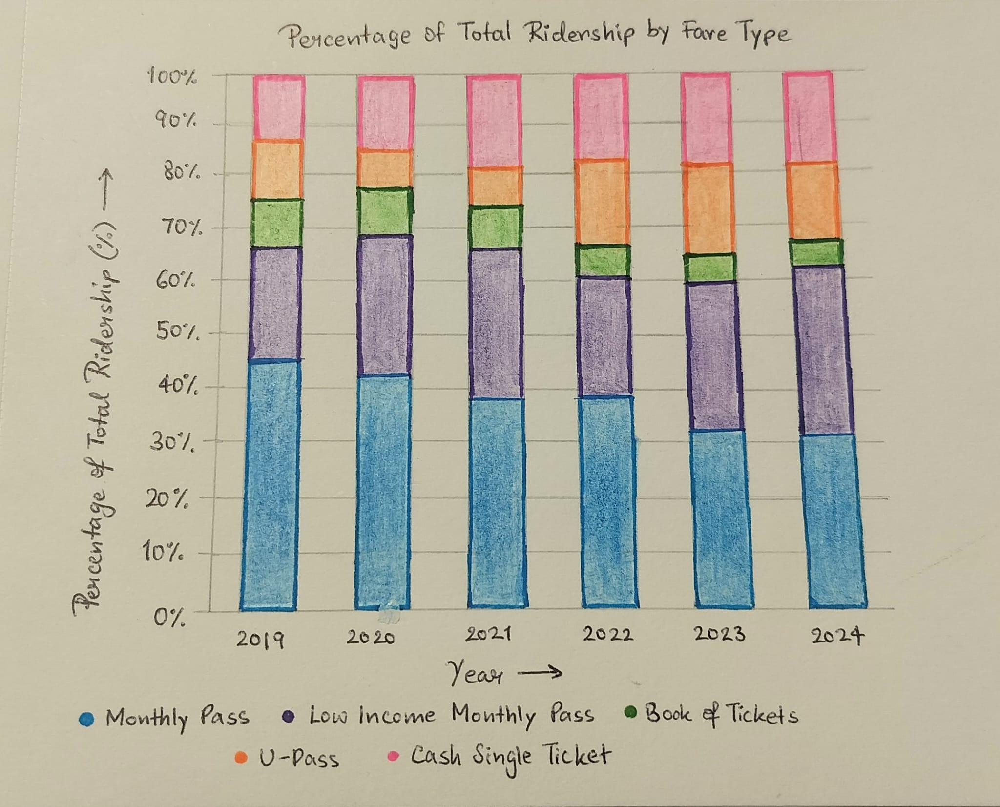
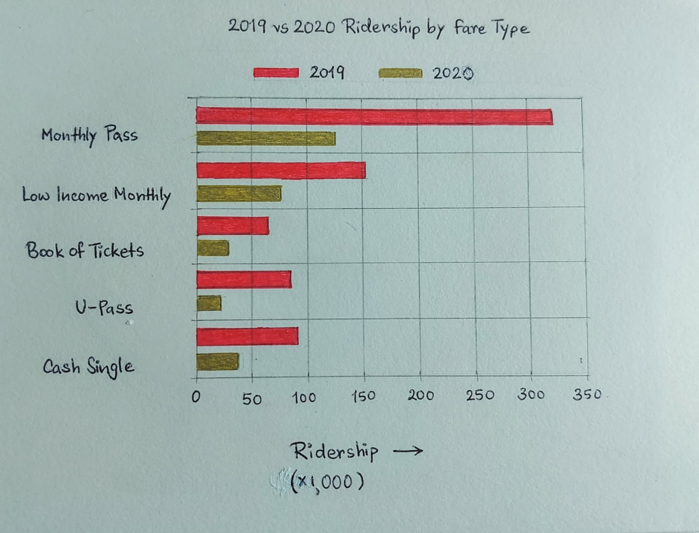
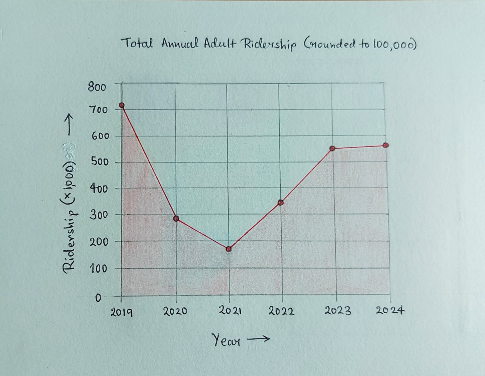
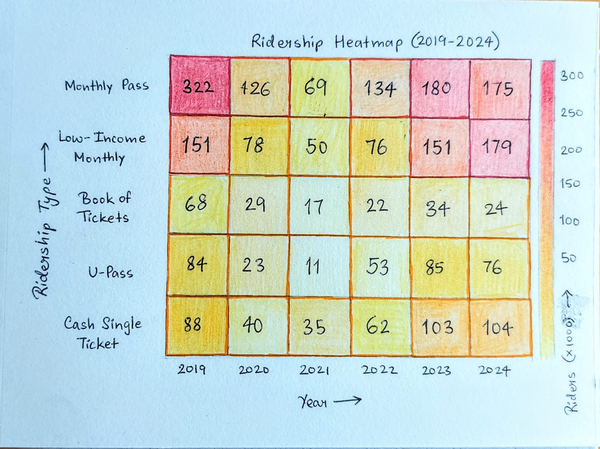
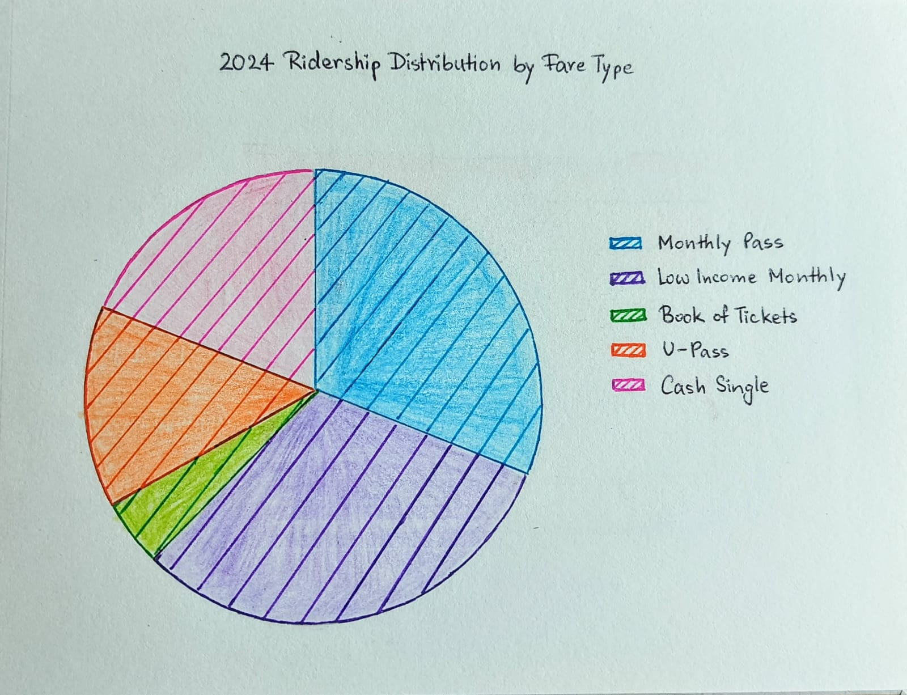

# Data Theme: Public Transport

## About
The data set for this directory comes from the [City of Calgary](https://data.calgary.ca/) Open Data Portal and is the 
annual aggregated number of [transit users](https://data.calgary.ca/Transportation-Transit/Calgary-Transit-Ridership/iema-jbc4/about_data) from 2019-2024.

Adult transit riders (total) by fair type  for Calgary aggregated over years from 2019-2024 and rounded to 100000 riders.

## Visualizations  

### Visualization 1  

### Visualization 2 

### Visualization 3

### Visualization 4 

### Visualization 5 
