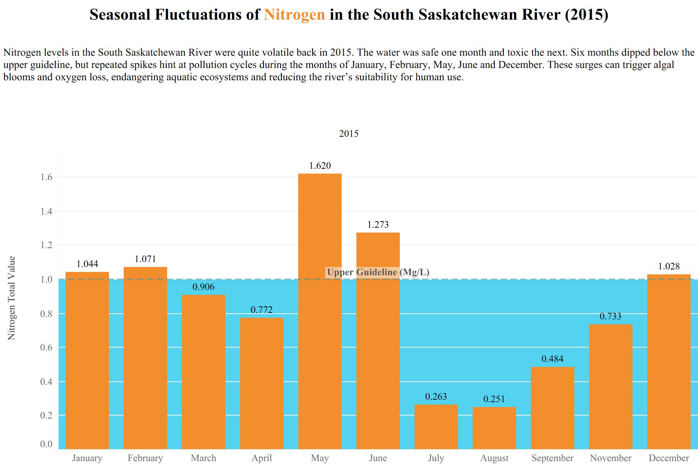
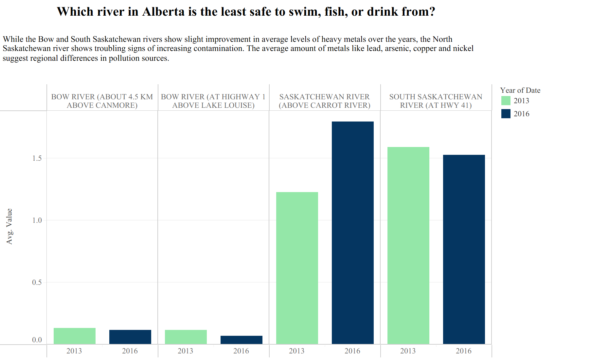
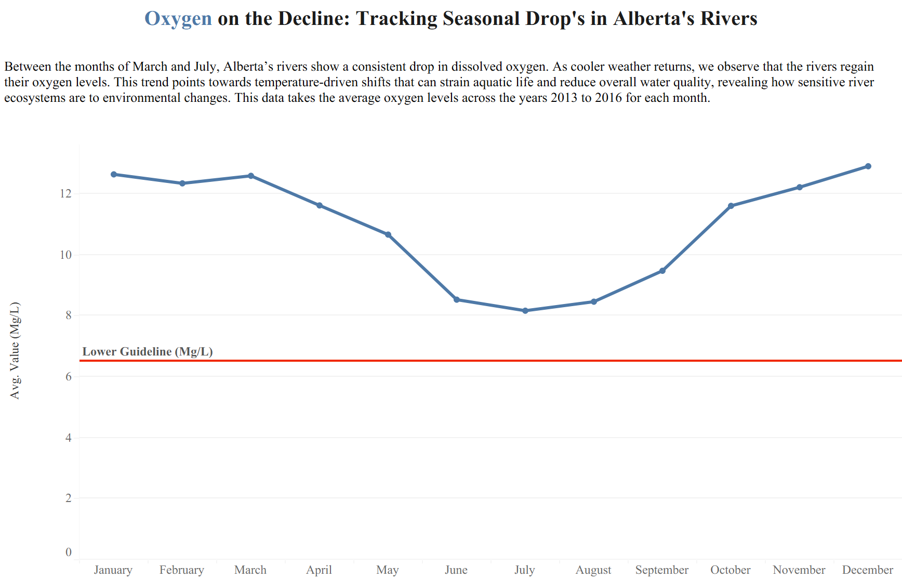
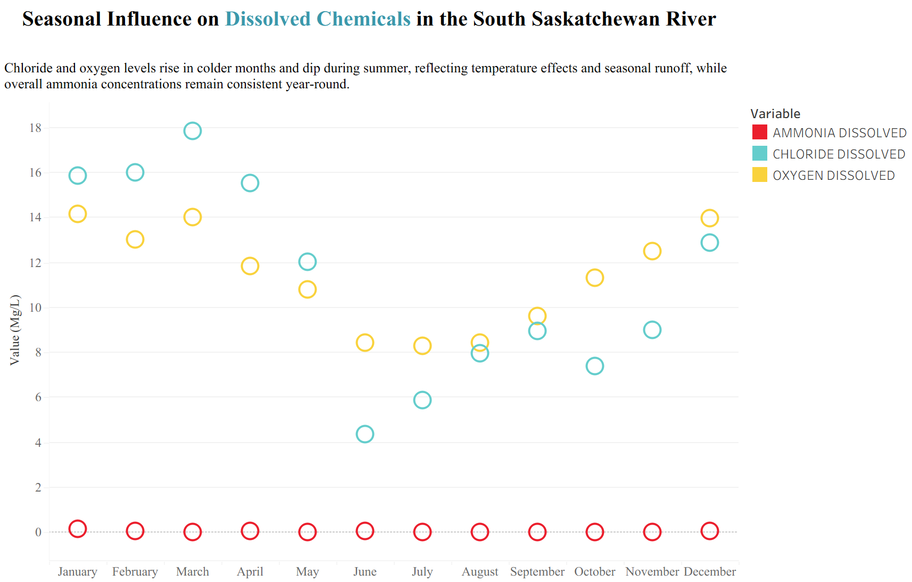
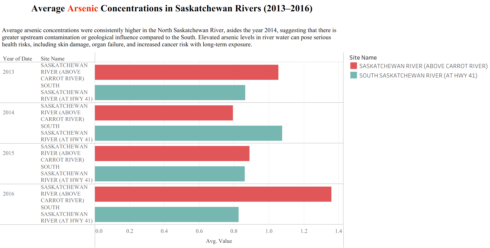

# Data Theme: Natural World

## About
The data set for this directory is from the [Government of Canada](https://open.canada.ca/data/en/dataset/b1a61a9e-16ca-44a7-bf58-c9e4f4860884) 
on water quality indicators. The full dataset includes samples from waterways across Canada but for this exercise will 
only be looking at the Saskatchewan river, South Saskatchewan river, and the Bow River at two locations. This will also 
focus on just 10 of the variables tested for the years of 2013-2016.

## Visualizations  

### Visualization 1  

### Visualization 2 

### Visualization 3

### Visualization 4 

### Visualization 5 
