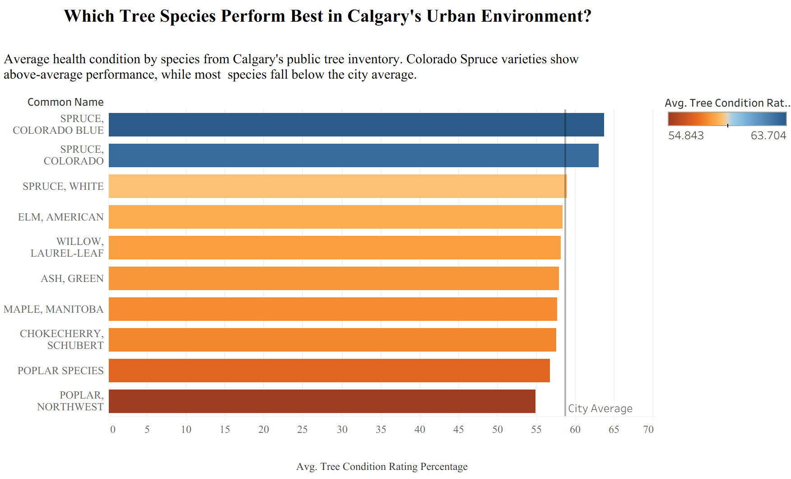
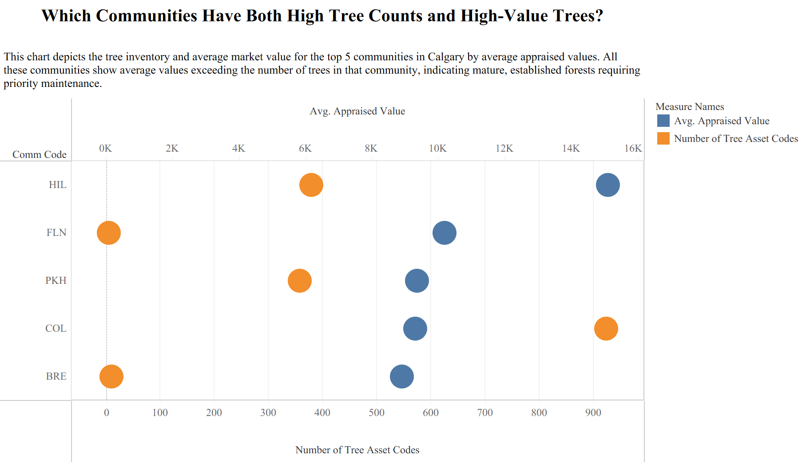
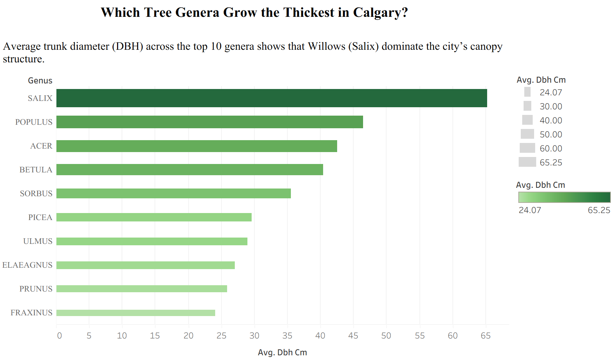
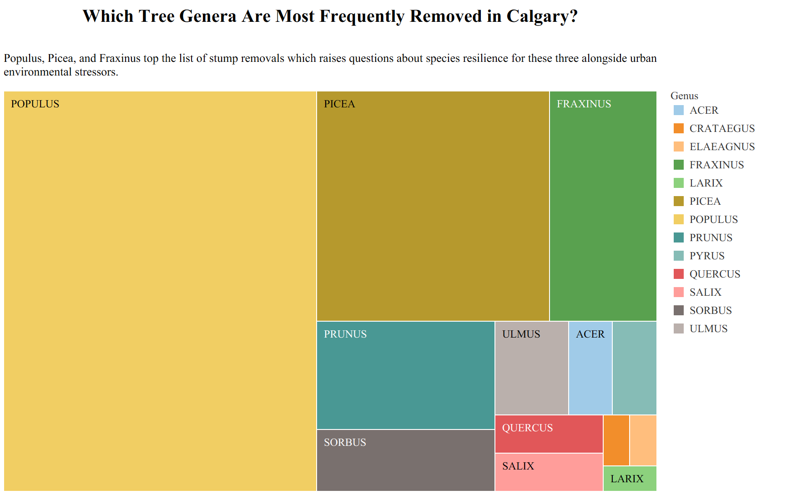
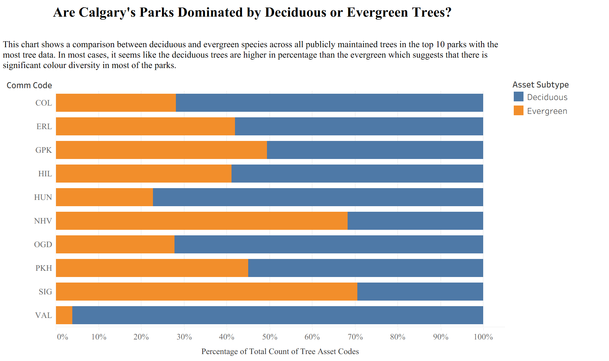

# Data Theme: Natural World

## About
The data set for this directory is from the [Calgary Open Data Portal](https://data.calgary.ca/Environment/Public-Trees/tfs4-3wwa/about_data) 
on public trees. The full dataset includes all public trees in the City of Calgary but for this exercise will only be 
looking at trees that are maintained by Parks and other Business Units. There are a range of quantitative and qualitative 
categories for you to explore. For details about what each attribute means refer to this 
[website](https://data.calgary.ca/Environment/Public-Trees/tfs4-3wwa/about_data) where the full data set can be found.

## Visualizations  

### Visualization 1  

### Visualization 2 

### Visualization 3

### Visualization 4 

### Visualization 5 
